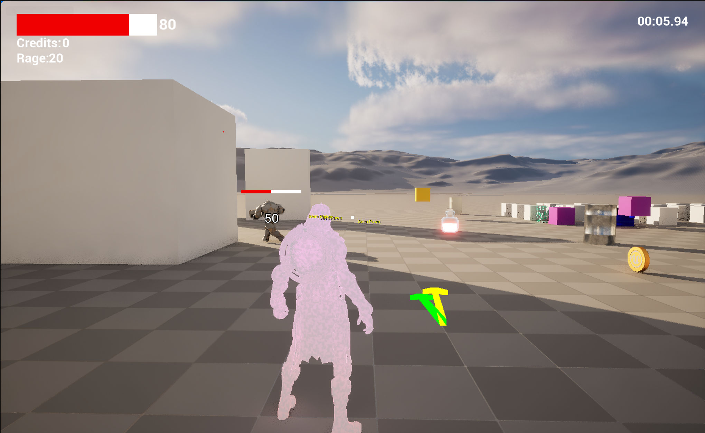
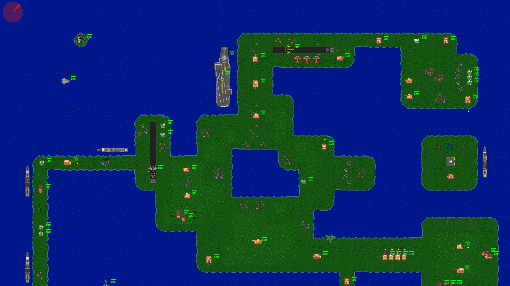

## **Projects**
- ### 3rd Person Action Game

This game was created as part of [Tom Looman's](https://www.tomlooman.com/) Unreal C++ course. The course is taught using UE4 but I opted to use UE5 instead to learn the most recent version of the engine. I created a game with a player character with three main abilities. These three abilities were implemented through my own version of Unreal's gameplay abilitiy system. Creating my own version from scratch allowed me to understand how the GAS system works at a bunch simpler level. This allows me the oppurtunity to return and add more abilities to this character much easier. I also learned the environment query system and utilized that to create plots where an enemy character was able to randomize its position and use the world as cover. The enemy character used behavior trees in order to determine what it should do next. It's capable of finding the player, attacking, hiding, and healing. 

- ### Custom C++ Engine

I developed a custom 2D game engine in C++ using SDL2, featuring an Entity-Component System architecture. The engine supports user input, tilemap rendering, and collision detection. I integrated Lua scripting with Sol for rapid level design and iteration, and implemented an ImGui-powered debug menu for real-time entity spawning and system testing.

- ### Blueprint FPS Game

  <iframe src="https://www.youtube.com/embed/otHC3OMmbFc"
    style="position: absolute; top: 0; left: 0; width: 100%; height: 100%;"
    frameborder="0"
    allow="accelerometer; autoplay; clipboard-write; encrypted-media; gyroscope; picture-in-picture; web-share"
    allowfullscreen>
  </iframe>

My goal when creating this game was to gain an understanding of how the blueprint system worked in unreal. Although unreal lets you use blueprint or C++ the reccommended way of using the engine is by blending both together. At first I was only using C++ but I knew that I needed to understand more about blueprint. This is a simple FPS prototype that was created entirely in blueprints. There is animations, audio, and enemy AI, ammo/health pickups, all implemented. The point of the game is to eliminate all the drones in the streets before time runs out.
